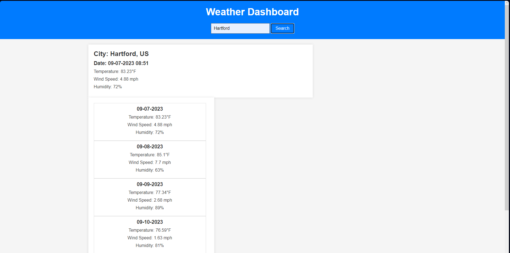

## Weather Planner ##
This application is a simple way to track the current weather and the upcoming forecast for the next 5 days using OpenWeatherAPI.

## User Story ##
As a user I want to be able to plan my vacation according to the weather. I dont want to be stuck at the beach when its raining, or stuck in a museum when I could enjoying nice hot weather. I want to be able to look at the upcoming forecast for many different cities and plan where I will go based on the weather.

## How it Works ##
The application works by taking a user input for a city, fetching the current weather for the city using openweatherapi, and displaying that through appended elements using Javascript. The 5 day forecast works by taking 8 intervals of 3 hours and displaying the weather for that time. 8*3 = 24 so the 5 day forecast will show 24, 48, 72 hours and so on from now in their own card. The site keeps track of previously searched cities in the bottom of the page using local storage. This means that when the page is refreshed the user wont lose all the planning and cities they have previously searched!

## Image of the application in use ##

## The Source Code is Available At ##
https://github.com/kiedae/localweather

## The Deployed Application is Available at ##
https://kiedae.github.io/localweather
